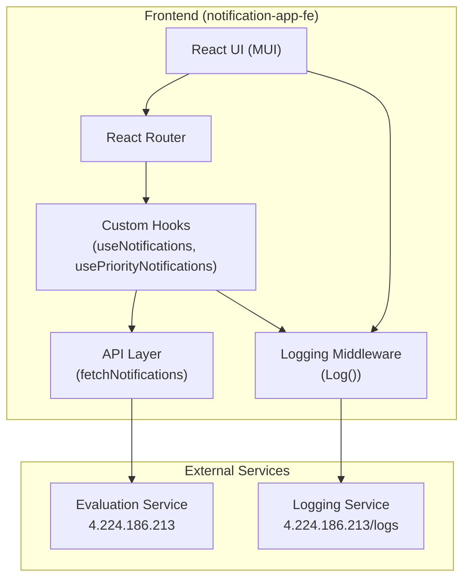
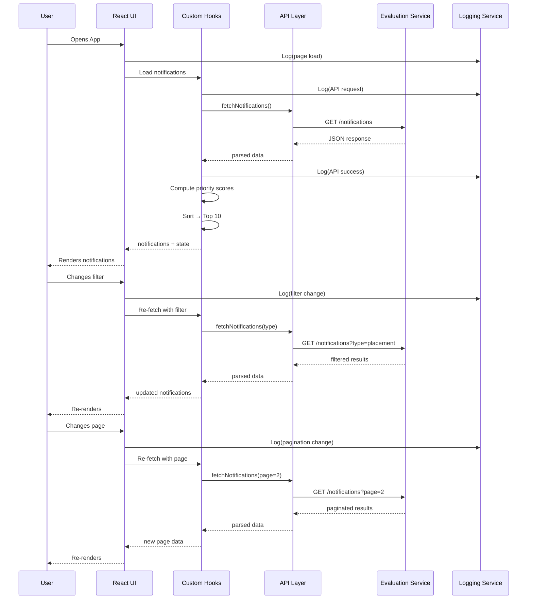

# Notification System Design

## Stage 1: Notification API Integration

### Overview

Fetch notifications from the external evaluation service API, apply a priority-based sorting algorithm, and maintain a top-10 notification window in memory.

### API Endpoint

```
GET http://4.224.186.213/evaluation-service/notifications
```

**Headers:**
- `Authorization: Bearer <token>`
- `Content-Type: application/json`

**Query Parameters:**
| Param            | Type   | Default | Description                     |
|------------------|--------|---------|----------------------------------|
| `page`           | number | 1       | Page number                     |
| `limit`          | number | 10      | Notifications per page          |
| `notification_type` | string | —    | Filter: placement / result / event |

---

## Priority Algorithm

Each notification carries a `type` field. The priority score is derived from the notification type:

| Type        | Priority Score |
|-------------|----------------|
| Placement   | 3              |
| Result      | 2              |
| Event       | 1              |

### Sorting Rule

1. **Primary:** Priority score descending (higher priority first)
2. **Secondary:** Timestamp descending (newer notifications first within the same priority)

### Pseudocode

```
function getPriorityScore(type):
    switch type:
        case "placement": return 3
        case "result":    return 2
        case "event":     return 1
        default:          return 0

function getTop10(notifications):
    scored = notifications.map(n => ({ ...n, priority: getPriorityScore(n.type) }))
    scored.sort((a, b) =>
        b.priority - a.priority ||
        new Date(b.timestamp) - new Date(a.timestamp)
    )
    return scored.slice(0, 10)
```

---

## Time Complexity

| Operation                | Complexity |
|--------------------------|------------|
| Priority scoring (map)   | O(N)       |
| Sorting                  | O(N log N) |
| Top-10 slice             | O(1)       |
| **Overall**              | **O(N log N)** where N = total notifications fetched |

## Space Complexity

| Component        | Space     |
|------------------|-----------|
| Fetched array    | O(N)      |
| Sorted copy      | O(N)      |
| Top-10 result    | O(1)      |
| **Overall**      | **O(N)**  |

For large datasets, a min-heap of size 10 can reduce space to O(1) beyond the input.

---

## Top 10 Maintenance

1. All notifications are fetched from the API on page load.
2. Each notification is scored using the priority algorithm.
3. The list is sorted by priority desc → timestamp desc.
4. The first 10 entries form the **Priority Inbox**.
5. The result is cached in component state; re-fetching replaces the list.

---

## Handling Newly Arriving Notifications

On each page load or manual refresh:
1. The full notification list is re-fetched from the API.
2. The priority algorithm is re-applied.
3. The top-10 is recomputed from scratch.

For a real-time extension, a WebSocket or polling mechanism could push new notifications to the client, where they are inserted into the existing sorted list and the top-10 window is adjusted.

---

## Scalability Considerations

| Concern                  | Strategy |
|--------------------------|----------|
| Large payloads           | Paginate API responses; process in chunks |
| Frequent sorting         | Use a fixed-size min-heap (O(N log K)) instead of full sort |
| Caching                 | `sessionStorage` or `localStorage` with TTL for offline resilience |
| API rate limiting       | Debounce re-fetches; exponential backoff on errors |
| Separation of concerns  | Move priority logic to a backend service for heavy workloads |
| Concurrent users        | Stateless design — each client computes priority independently |

---

## Architecture Diagram (Mermaid)



## Flow Diagram (Mermaid)


